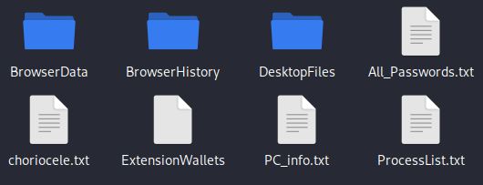
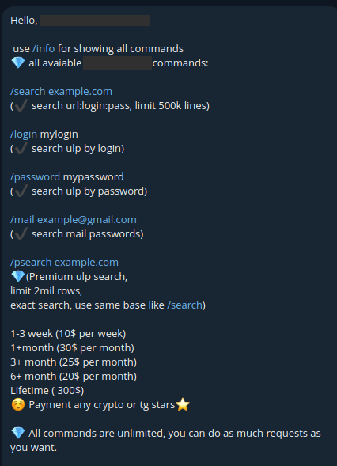

# Leaked Credentials: The easy way

A good way to gain system access is to use leaked credentials; with these, you can save yourself the effort of doing attacks like password brute force or exploiting more complex vulnerabilities. Just find the correct user and password and enter them into the target system, but how do you get the leak??

We can see on internet news about leaks and data breaches from a company or an application and how users sell the data on dark web forums or just make a public share in some anonymous file hosting services, but now there are easy-to-use tools in platforms like Telegram with free access. Obviously there is no magic; data should come from somewhere because these tools don't "hack" accounts at the same time that you search the leaked data, so let's break down this workflow.

An attacker (1) delivers a malware stealer to a company employee, the victim (employee) executes the malware (hidden in an exe file) in a job computer, this machine can be used by the target user to connect to internal company systems like servers, web applications, and databases or, in some cases, personal activities like social networks and government procedures, while the stealer is running and searching and collecting all the users' credentials.

Stealers exfiltrate the collected data back to the attacker. They receive data in a command and control server or in a stealer panel. The attacker can separate data by type (credentials, session cookies, crypto wallet data) for credentials. One of the most common formats is the ULP list `<URL>:<login>:<passwrod>`; these are text files with a collection of leaked data with lines like this `https://company-domain.com/login.php:employee1:myversysecurepassword`, these lists can have millions of lines from different victims or from many different sources, like combo lists.

![[daisy-pc-info-EP.png]](../images/daisy-pc-info-EP.png)

Then, with data in a specific site like a ULP database, attackers can create a tool for their own use or to share it. These can be paid tools or free and can be found in dark web marketplaces, clear net sites from legitimate security companies, or in Telegram channels, groups, or bots.

In the leak tools, other attackers can search for credentials from specific targets; if the target is compromised with credentials, they can use them to gain access, increasing the attack surface. The access can giveattackers control over servers, databases, or web apps, for example, applications of CI/CD like Jenkins that enable users to run commands and get a reverse shell without having server credentials.

Maybe the highest risk is when a user from a company is infected with a stealer, and it is spreading on the company network to other devices and ends up exfiltrating company sensitive data.

![[stealer-flow.png]](../images/stealer-flow.png)

But just mentioning how these attacks might work makes no sense without a real example. The following demo was done with some Telegram bots that search data leaks and is only for educational purposes only.

The first thing is to search all the leaks in the bot database about a specific domain; this bot uses the command `/search <domain>` and returns a txt file with the data in the format `<url>:<login>:<password>`. These are known as ULP files.

The bot shows the query position, which means a place in a wait queue, and also shows the format for results as it was mentioned about ULP. Other information returned here is the number of times that the web domain was searched before, in this case just 1 time, and before getting the file, a message shows how many leaked credentials the result file has: 2751 lines for this domain.

![[dmo-ttm-EP.png]](../images/dmo-ttm-EP.png)

Then with the leaked credentials file download, we can review line by line to check the data and select one ULP record to test. It is important to note that not all the lines are valid; they may have been changed by the account owner after the exfiltration. Note in the image the `:` that separates each element of the **ULP**. For privacy reasons, I blur the URL, email, and password; just a segment of the email is shown to identify the user in the test.

![[jcf-0-EP.png]](../images/jcf-0-EP.png)

Now if the URL is valid like this one, we can test the leaked credentials. Some sites use security measures like blocking connections from different countries to the website, but this can be bypassed with a VPN using a server in the same country as the target.

![[jcf-1-EP.png]](../images/jcf-1-EP.png)

In this case the credentials used for the test were valid; note that the username is the same as the email segment shown in the TXT file. This site allows us to watch personal information about the user because it is a website to apply for a government job, and it has the forms filled for users with personal details like address, contact methods, family information, and access to a webmail inbox.

![[jcf-3-EP.png]](../images/jcf-3-EP.png)

Here the system is for non-privileged users, but in ULPs it is also possible to find access credentials to server management applications like cPanel, WHM, WordPress, and other types of platforms and technologies that allow access to the server through a reverse shell, for example.

I have spoken with the admin and developer of a Telegram bot that searches leaked data in their own database, one of the biggest in the world. Having these talks is very important to see the cybersecurity environment from other perspectives to improve our knowledge.

Why do tech-skilled people choose to create a public tool to search leaked credentials? Well, the bot developer, referred to as K, says that this tool was created for their own use, but when they realized how well it worked, they decided to make it public and free, and the bot is now widely used because of the simplicity and the big data volume that it provides to users.

About the simplicity of the bot, the users can search leaks by web domains, by email, and by password—all of this for free—and there is just one paid feature that is like a filter to search in strict mode for leaks of a web domain or web page. I askedK if the charge for this function is profitable, but it says that it is more to cover the cost of the needed PC resources because the tool consumes a lot of them. It also mentions creating new features in the future but does not know what.

![[ttm-by-mail-EP.png]](../images/ttm-by-mail-EP.png)

The BOT works as an access point of a leaks database, and as K says, the source of this data is stealers, a malware type that is widely spread and uses mining data from victims that ends up in these databases available to everyone, and in K's words, this is due to "human stupidity and naivety." He also says that these attacks can be avoided if users do not open or run unknown EXE files.